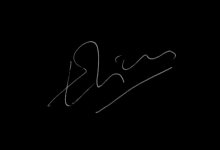

# SigVer: Offline Signature Verification

SigVer provides neural models and training scripts for verifying handwritten signatures on paper. The original project was created to learn writer–independent representations and classifiers in PyTorch. This repository also demonstrates how to export the trained weights to ONNX so the models can be used in other runtimes such as .NET.

## Quick installation

1. Install Python requirements:
   ```bash
   pip install -r requirements.txt
   ```
2. Export the pretrained weights to ONNX:
   ```bash
   python convert_to_onnx.py
   ```
   The script produces `models/signet.onnx` and `models/signet_f_lambda_0.95.onnx`.
3. Install the .NET SDK (required to build `SigVerSdk`) if it is not already
   available:
   ```bash
   ./dotnet-install.sh --channel 8.0
   ```

## Using PyTorch models

To extract features from a signature using PyTorch:

```python
import torch
from sigver.featurelearning.models import SigNet

state_dict, _, _ = torch.load('models/signet.pth')
model = SigNet().eval()
model.load_state_dict(state_dict)
with torch.no_grad():
    feats = model(image_tensor)
```

## ONNX models

The exported ONNX networks are equivalent to the PyTorch weights `signet.pth` and `signet_f_lambda_0.95.pth`. They output a 2048‑dimensional feature vector and can be used with any ONNX runtime.

## .NET SDK

The `SigVerSdk` folder contains a small .NET library that relies on `onnxruntime`. It loads an ONNX model and computes signature features. Example usage in C#:

```csharp
using var verifier = new SigVerSdk.SigVerifier("models/signet.onnx");
float[] features = verifier.ExtractFeatures("data/a1.png");
```

The library relies on OpenCvSharp for image processing. The native component
`libOpenCvSharpExtern.so` is provided under the `so` directory and is copied to
the output folders of the .NET projects. If the file cannot be found at runtime
add the `so` directory to `LD_LIBRARY_PATH`.

`ExtractFeatures` now mirrors the Python preprocessing pipeline. Images are
centered on a 1360×840 canvas, cleaned with Otsu thresholding, resized to
170×242 and then cropped to 150×220 before the model is invoked. The method also
validates the output, throwing an exception when the model returns NaN or
infinite values.

The unit tests in `SigVerSdk.Tests` illustrate a simple verification scenario comparing two signatures.

If the required SDK is missing, run the provided install script before building:

```bash
./dotnet-install.sh --channel 8.0
```

## Data preprocessing

Training scripts expect data in a single `.npz` file containing:

* `x`: signature images (N × 1 × H × W)
* `y`: the user that produced each signature (N)
* `yforg`: whether the image is a forgery (1) or genuine (0)

Common datasets can be processed with `sigver.datasets.process_dataset`. For example, the MCYT dataset can be prepared as follows:

```bash
python -m sigver.preprocessing.process_dataset --dataset mcyt \
  --path MCYT-ORIGINAL/MCYToffline75original --save-path mcyt_170_242.npz
```
During training a random 150×220 crop is used; at test time the center crop is applied.

## Training writer‑independent networks

Two loss functions are implemented as described in the original paper:

* **SigNet** – uses only genuine signatures.
* **SigNet‑F** – incorporates knowledge of forgeries (`--forg`).

Example commands:

```bash
python -m sigver.featurelearning.train --model signet --dataset-path <data.npz> \
  --users 300 881 --epochs 60 --logdir signet

python -m sigver.featurelearning.train --model signet --dataset-path <data.npz> \
  --users 300 881 --epochs 60 --forg --lamb 0.95 --logdir signet_f_lamb0.95
```

All command line options are listed with `python -m sigver.featurelearning.train --help`. Real‑time monitoring is available with the `--visdom-port` option.

## Training writer‑dependent classifiers

To train and evaluate WD classifiers:

```bash
python -m sigver.wd.test -m signet --model-path <path/to/trained_model> \
    --data-path <path/to/data> --save-path <path/to/save> \
    --exp-users 0 300 --dev-users 300 881 --gen-for-train 12
```

The script performs K random splits (default 10) and stores a pickle file with results containing metrics such as FAR and FRR as well as the predictions for each image.

## Pre‑trained models

Pre‑trained weights are available for convenience:
* [SigNet](https://drive.google.com/open?id=1l8NFdxSvQSLb2QTv71E6bKcTgvShKPpx)
* [SigNet‑F lambda 0.95](https://drive.google.com/open?id=1ifaUiPtP1muMjt8Tkrv7yJj7we8ttncW)

These weights were trained with pixel values in the range [0, 1]. Divide each pixel by 255 before inference, e.g. `x = x.float().div(255)`. `torchvision.transforms.ToTensor` already performs this division.

## Example dataset

The repository contains a small dataset in the `data` directory. Each folder such
as `001` holds genuine signatures from a single user. The matching folder
`001_forg` stores forged signatures produced by other writers. Every user has 24
genuine samples and roughly 8–12 forgeries. Below is a preview showing ten pairs
from the `001` and `002` folders—genuine signatures on the left and forgeries on
the right.

<table>
  <tr>
    <td></td>
    <td></td>
  </tr>
  <tr>
    <td></td>
    <td></td>
  </tr>
  <tr>
    <td></td>
    <td></td>
  </tr>
  <tr>
    <td></td>
    <td></td>
  </tr>
  <tr>
    <td></td>
    <td></td>
  </tr>
  <tr>
    <td></td>
    <td></td>
  </tr>
  <tr>
    <td></td>
    <td></td>
  </tr>
  <tr>
    <td></td>
    <td></td>
  </tr>
  <tr>
    <td></td>
    <td></td>
  </tr>
  <tr>
    <td></td>
    <td></td>
  </tr>
</table>

### Preprocessing comparison

The verifier preprocesses every input image before running the ONNX model. The
Python library and the C# implementation follow the same sequence of
operations: a light Gaussian blur is applied, the signature is centred on an
840×1360 canvas, background pixels are removed using Otsu thresholding, the
image is resized to 170×242 and finally a 150×220 crop is taken. The tables
below show the resulting images for those involved in the failing test as well
as ten examples from passing tests.

#### Failing test images

| Original | Python | .NET |
|---------|--------|------|
| `001_01.PNG` |  |  |
| `001_02.PNG` |  |  |
| `002_01.PNG` |  |  |
| `002_02.PNG` |  |  |

#### Passing examples

| Original | Python | .NET |
|---------|--------|------|
| `004_04.PNG` |  |  |
| `0105004_03.png` |  |  |
| `003_01.PNG` |  |  |
| `0126003_02.png` |  |  |
| `004_23.PNG` |  |  |
| `0103004_04.png` |  |  |
| `001_06.PNG` |  |  |
| `0119001_02.png` |  |  |
| `002_19.PNG` |  |  |
| `0118002_02.png` |  |  |

### Automated C# tests

The SDK includes a test suite that randomly generates signature pairs from the
`data` directory. Each user has a folder such as `001` with genuine signatures
and a matching folder `001_forg` with forgeries. Using xUnit, thirty pairs are
sampled in two categories:

1. **Genuine vs forged** — one genuine signature from `XXX` against one forged
   signature from `XXX_forg`.
2. **Genuine vs genuine** — two different genuine signatures from the same
   folder `XXX`.

Random selection uses a fixed seed so results are reproducible. The tests assert
that forged signatures are detected and that genuine pairs match. Running
`dotnet test` executes all sixty comparisons and logs the verification time for
each pair.

## Test results

The tables below show the outcome of running the signature verifier on 60
randomly selected pairs from the `data` directory. Half of the pairs compare a
genuine signature with a forged one, while the other half compare two genuine
signatures of the same user. Each comparison reports whether the verifier
behaved as expected and how long it took.

### Genuine vs forged

| img1       | img2           | expected   | is_forg_py   | match_py   |   dist_py | is_forg_net   | match_net   |   dist_net |    diff |
|:-----------|:---------------|:-----------|:-------------|:-----------|----------:|:--------------|:------------|-----------:|--------:|
| 003_19.PNG | 0121003_04.png | True       | True         | True       |    0.6158 | True          | True        |     0.4813 | -0.1345 |
| 002_14.PNG | 0110002_02.png | True       | False        | False      |    0.1570 | False         | False       |     0.1465 | -0.0105 |
| 001_10.PNG | 0119001_04.png | True       | True         | True       |    0.4402 | True          | True        |     0.4302 | -0.0100 |
| 003_23.PNG | 0121003_01.png | True       | True         | True       |    0.5576 | True          | True        |     0.4883 | -0.0692 |
| 003_19.PNG | 0126003_02.png | True       | True         | True       |    0.4762 | True          | True        |     0.4030 | -0.0732 |
| 001_09.PNG | 0119001_01.png | True       | False        | False      |    0.2857 | False         | False       |     0.2075 | -0.0782 |
| 001_01.PNG | 0201001_03.png | True       | True         | True       |    0.4815 | True          | True        |     0.4787 | -0.0028 |
| 001_19.PNG | 0201001_02.png | True       | True         | True       |    0.3554 | False         | False       |     0.3301 | -0.0254 |
| 003_11.PNG | 0121003_04.png | True       | True         | True       |    0.7528 | True          | True        |     0.7081 | -0.0447 |
| 004_15.PNG | 0124004_02.png | True       | False        | False      |    0.2813 | False         | False       |     0.2261 | -0.0552 |
| 001_02.PNG | 0201001_01.png | True       | False        | False      |    0.2711 | False         | False       |     0.3028 |  0.0317 |
| 003_04.PNG | 0121003_01.png | True       | True         | True       |    0.7522 | True          | True        |     0.7346 | -0.0176 |
| 003_12.PNG | 0206003_03.png | True       | False        | False      |    0.2477 | False         | False       |     0.2457 | -0.0019 |
| 002_22.PNG | 0110002_01.png | True       | False        | False      |    0.2277 | False         | False       |     0.2175 | -0.0102 |
| 004_14.PNG | 0124004_01.png | True       | True         | True       |    0.3852 | False         | False       |     0.3049 | -0.0803 |
| 004_01.PNG | 0124004_03.png | True       | False        | False      |    0.2892 | False         | False       |     0.3168 |  0.0276 |
| 002_11.PNG | 0108002_03.png | True       | False        | False      |    0.1822 | False         | False       |     0.1978 |  0.0156 |
| 002_21.PNG | 0110002_02.png | True       | False        | False      |    0.1568 | False         | False       |     0.1608 |  0.0040 |
| 003_08.PNG | 0121003_02.png | True       | True         | True       |    0.7421 | True          | True        |     0.6692 | -0.0729 |
| 001_03.PNG | 0119001_04.png | True       | True         | True       |    0.4891 | True          | True        |     0.4551 | -0.0340 |
| 001_17.PNG | 0201001_03.png | True       | True         | True       |    0.4047 | True          | True        |     0.3759 | -0.0288 |
| 002_12.PNG | 0108002_01.png | True       | False        | False      |    0.1880 | False         | False       |     0.2176 |  0.0296 |
| 002_19.PNG | 0108002_04.png | True       | False        | False      |    0.1807 | False         | False       |     0.1340 | -0.0467 |
| 002_04.PNG | 0108002_01.png | True       | False        | False      |    0.2035 | False         | False       |     0.2224 |  0.0189 |
| 002_03.PNG | 0108002_01.png | True       | False        | False      |    0.2063 | False         | False       |     0.2176 |  0.0113 |
| 003_16.PNG | 0121003_02.png | True       | True         | True       |    0.5961 | True          | True        |     0.5210 | -0.0751 |
| 001_23.PNG | 0119001_02.png | True       | True         | True       |    0.4781 | True          | True        |     0.4228 | -0.0553 |
| 001_19.PNG | 0201001_03.png | True       | True         | True       |    0.4273 | True          | True        |     0.3847 | -0.0427 |
| 002_11.PNG | 0110002_01.png | True       | False        | False      |    0.1199 | False         | False       |     0.1105 | -0.0094 |
| 001_12.PNG | 0201001_01.png | True       | False        | False      |    0.1936 | False         | False       |     0.2102 |  0.0166 |
### Genuine vs genuine

| img1       | img2       | expected   | is_forg_py   | match_py   |   dist_py | is_forg_net   | match_net   |   dist_net |    diff |
|:-----------|:-----------|:-----------|:-------------|:-----------|----------:|:--------------|:------------|-----------:|--------:|
| 004_03.PNG | 004_12.PNG | False      | False        | True       |    0.0520 | False         | True        |     0.0345 | -0.0175 |
| 001_09.PNG | 001_06.PNG | False      | False        | True       |    0.1563 | False         | True        |     0.1783 |  0.0220 |
| 003_18.PNG | 003_21.PNG | False      | False        | True       |    0.1394 | False         | True        |     0.1734 |  0.0340 |
| 004_23.PNG | 004_24.PNG | False      | False        | True       |    0.1760 | False         | True        |     0.1688 | -0.0073 |
| 003_16.PNG | 003_09.PNG | False      | False        | True       |    0.3337 | False         | True        |     0.3427 |  0.0090 |
| 001_05.PNG | 001_10.PNG | False      | False        | True       |    0.1720 | False         | True        |     0.1716 | -0.0004 |
| 001_08.PNG | 001_15.PNG | False      | False        | True       |    0.2323 | False         | True        |     0.2625 |  0.0303 |
| 001_06.PNG | 001_19.PNG | False      | False        | True       |    0.3127 | False         | True        |     0.3025 | -0.0102 |
| 001_14.PNG | 001_04.PNG | False      | False        | True       |    0.2155 | False         | True        |     0.2112 | -0.0043 |
| 003_17.PNG | 003_07.PNG | False      | True         | False      |    0.3951 | True          | False       |     0.3739 | -0.0212 |
| 003_09.PNG | 003_20.PNG | False      | True         | False      |    0.4111 | True          | False       |     0.3682 | -0.0429 |
| 004_17.PNG | 004_08.PNG | False      | False        | True       |    0.1895 | False         | True        |     0.1615 | -0.0280 |
| 003_22.PNG | 003_14.PNG | False      | False        | True       |    0.1710 | False         | True        |     0.1384 | -0.0326 |
| 002_09.PNG | 002_17.PNG | False      | False        | True       |    0.1204 | False         | True        |     0.1283 |  0.0079 |
| 004_23.PNG | 004_12.PNG | False      | False        | True       |    0.1139 | False         | True        |     0.1121 | -0.0018 |
| 004_17.PNG | 004_22.PNG | False      | False        | True       |    0.0637 | False         | True        |     0.0394 | -0.0244 |
| 001_02.PNG | 001_01.PNG | False      | False        | True       |    0.0834 | False         | True        |     0.0703 | -0.0131 |
| 001_10.PNG | 001_19.PNG | False      | False        | True       |    0.2234 | False         | True        |     0.2036 | -0.0198 |
| 001_11.PNG | 001_12.PNG | False      | False        | True       |    0.1284 | False         | True        |     0.1201 | -0.0083 |
| 001_20.PNG | 001_17.PNG | False      | False        | True       |    0.0862 | False         | True        |     0.0756 | -0.0105 |
| 003_11.PNG | 003_09.PNG | False      | False        | True       |    0.1159 | False         | True        |     0.0870 | -0.0289 |
| 004_01.PNG | 004_09.PNG | False      | False        | True       |    0.2229 | False         | True        |     0.2174 | -0.0055 |
| 003_10.PNG | 003_03.PNG | False      | False        | True       |    0.1105 | False         | True        |     0.1163 |  0.0057 |
| 003_06.PNG | 003_20.PNG | False      | True         | False      |    0.3519 | False         | True        |     0.3099 | -0.0421 |
| 001_11.PNG | 001_15.PNG | False      | False        | True       |    0.2142 | False         | True        |     0.2156 |  0.0014 |
| 001_20.PNG | 001_13.PNG | False      | False        | True       |    0.1290 | False         | True        |     0.0959 | -0.0330 |
| 001_19.PNG | 001_22.PNG | False      | False        | True       |    0.0997 | False         | True        |     0.0902 | -0.0095 |
| 004_18.PNG | 004_22.PNG | False      | False        | True       |    0.0599 | False         | True        |     0.0627 |  0.0027 |
| 004_17.PNG | 004_18.PNG | False      | False        | True       |    0.0962 | False         | True        |     0.0715 | -0.0247 |
| 001_24.PNG | 001_05.PNG | False      | False        | True       |    0.2629 | False         | True        |     0.2618 | -0.0011 |
## Meta‑learning

Use the `sigver.metalearning.train` script to train a meta‑learner:

```bash
python -m sigver.metalearning.train --dataset-path <path/to/dataset.npz> \
    --pretrain-epochs <pretrain> --num-updates <gradient_steps> --num-rf <rand_forg> \
    --epochs <epochs> --num-sk-test <skilled_in_Dtest> --model <model>
```
`num-updates` specifies `K` in the paper, while `num-rf` controls how many random forgeries are used during adaptation.

## Converting models to ONNX
Run `python convert_to_onnx.py` to export the provided PyTorch weights to
`models/*.onnx` files. The script requires the `onnx` package.

There are currently no automated tests. After modifying the repository, ensure
that the export script still runs without errors.

## Citation

If you use this code, please cite:

1. Hafemann et al., *Learning Features for Offline Handwritten Signature Verification using Deep Convolutional Neural Networks* (2017).
2. Hafemann et al., *Characterizing and evaluating adversarial examples for Offline Handwritten Signature Verification* (2019).
3. Hafemann et al., *Meta-learning for fast classifier adaptation to new users of Signature Verification systems* (2019).

## License

The source code is released under the BSD 3‑Clause license. Models were trained on the GPDS dataset, which is restricted for non‑commercial use.

---

### Original project

This repository is based on the original [sigver](https://github.com/luizgh/sigver) project by Luiz G. Hafemann. The original README contains detailed explanations of the training procedure and dataset preparation which are reproduced here for convenience.