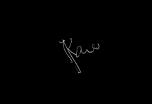
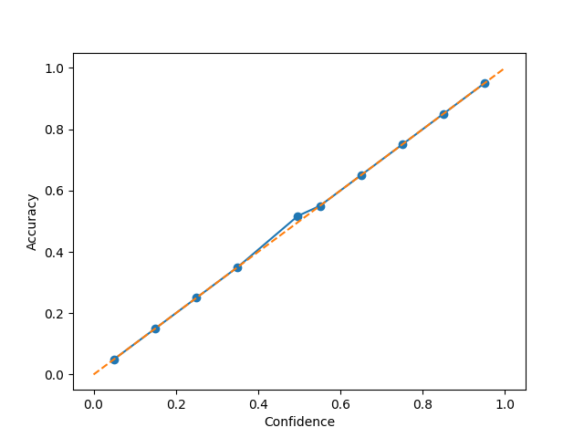

# SigVer: Offline Signature Verification

SigVer provides neural models and training scripts for verifying handwritten signatures on paper. The original project was created to learn writer–independent representations and classifiers in PyTorch. This repository also demonstrates how to export the trained weights to ONNX so the models can be used in other runtimes such as .NET.

All graphs and examples referenced throughout this README are available under the `docs/` folder.

## Quick installation

1. Install Python requirements:
   ```bash
   pip install -r requirements.txt
   ```
2. Export the pretrained weights to ONNX:
   ```bash
   python convert_to_onnx.py
   ```
   The script produces `models/signet.onnx` and `models/signet_f_lambda_0.95.onnx`.
3. Install the .NET SDK (required to build `SigVerSdk`) if it is not already
   available:
   ```bash
   ./dotnet-install.sh --channel 8.0
   ```

## Using PyTorch models

To extract features from a signature using PyTorch:

```python
import torch
from sigver.featurelearning.models import SigNet

state_dict, _, _ = torch.load('models/signet.pth')
model = SigNet().eval()
model.load_state_dict(state_dict)
with torch.no_grad():
    feats = model(image_tensor)
```

## ONNX models

The exported ONNX networks are equivalent to the PyTorch weights `signet.pth` and `signet_f_lambda_0.95.pth`. They output a 2048‑dimensional feature vector and can be used with any ONNX runtime.

## .NET SDK

The `SigVerSdk` folder contains a small .NET library that relies on `onnxruntime`. It loads an ONNX model and computes signature features. Example usage in C#:

```csharp
using var verifier = new SigVerSdk.SigVerifier("models/signet.onnx");
float[] features = verifier.ExtractFeatures("data/a1.png");
```

The library relies on OpenCvSharp for image processing. The native component
`libOpenCvSharpExtern.so` is provided under the `so` directory and is copied to
the output folders of the .NET projects. If the file cannot be found at runtime
add the `so` directory to `LD_LIBRARY_PATH`.

`ExtractFeatures` now mirrors the Python preprocessing pipeline. Images are
centered on a 1360×840 canvas, cleaned with Otsu thresholding, resized to
170×242 and then cropped to 150×220 before the model is invoked. The method also
validates the output, throwing an exception when the model returns NaN or
infinite values.

### Post‑processing in C#
After inference the SDK performs a small sequence of steps to transform the raw
output of the neural network into a final similarity score:

1. **Vector validation** – the output must contain exactly 2048 elements and
   cannot include `NaN` or infinite values; otherwise an exception is thrown.
2. **L2 normalisation** – the feature vector is divided by its Euclidean norm so
   that all vectors lie on the unit hypersphere.
3. **Cosine distance computation** – `SigVerifier.CosineDistance` returns
   `1 – dot(v1, v2)` for two normalised vectors.
4. **Thresholding** – `IsForgery` extracts and normalises the features of the
   reference and candidate signatures, computes the cosine distance and compares
   it with a configurable threshold (default 0.35) to decide whether the
   candidate is forged.

The unit tests in `SigVerSdk.Tests` illustrate a simple verification scenario
comparing two signatures.

The unit tests in `SigVerSdk.Tests` illustrate a simple verification scenario comparing two signatures.

If the required SDK is missing, run the provided install script before building:

```bash
./dotnet-install.sh --channel 8.0
```

## Data preprocessing

Training scripts expect data in a single `.npz` file containing:

* `x`: signature images (N × 1 × H × W)
* `y`: the user that produced each signature (N)
* `yforg`: whether the image is a forgery (1) or genuine (0)

Common datasets can be processed with `sigver.datasets.process_dataset`. For example, the MCYT dataset can be prepared as follows:

```bash
python -m sigver.preprocessing.process_dataset --dataset mcyt \
  --path MCYT-ORIGINAL/MCYToffline75original --save-path mcyt_170_242.npz
```
During training a random 150×220 crop is used; at test time the center crop is applied.

## Training writer‑independent networks

Two loss functions are implemented as described in the original paper:

* **SigNet** – uses only genuine signatures.
* **SigNet‑F** – incorporates knowledge of forgeries (`--forg`).

Example commands:

```bash
python -m sigver.featurelearning.train --model signet --dataset-path <data.npz> \
  --users 300 881 --epochs 60 --logdir signet

python -m sigver.featurelearning.train --model signet --dataset-path <data.npz> \
  --users 300 881 --epochs 60 --forg --lamb 0.95 --logdir signet_f_lamb0.95
```

All command line options are listed with `python -m sigver.featurelearning.train --help`. Real‑time monitoring is available with the `--visdom-port` option.

## Training writer‑dependent classifiers

To train and evaluate WD classifiers:

```bash
python -m sigver.wd.test -m signet --model-path <path/to/trained_model> \
    --data-path <path/to/data> --save-path <path/to/save> \
    --exp-users 0 300 --dev-users 300 881 --gen-for-train 12
```

The script performs K random splits (default 10) and stores a pickle file with results containing metrics such as FAR and FRR as well as the predictions for each image.

## Pre‑trained models

Pre‑trained weights are available for convenience:
* [SigNet](https://drive.google.com/open?id=1l8NFdxSvQSLb2QTv71E6bKcTgvShKPpx)
* [SigNet‑F lambda 0.95](https://drive.google.com/open?id=1ifaUiPtP1muMjt8Tkrv7yJj7we8ttncW)

These weights were trained with pixel values in the range [0, 1]. Divide each pixel by 255 before inference, e.g. `x = x.float().div(255)`. `torchvision.transforms.ToTensor` already performs this division.

## Example dataset

The repository contains a small dataset in the `data` directory. Each folder such
as `001` holds genuine signatures from a single user. The matching folder
`001_forg` stores forged signatures produced by other writers. Every user has 24
genuine samples and roughly 8–12 forgeries. Below is a preview showing ten pairs
from the `001` and `002` folders—genuine signatures on the left and forgeries on
the right.

<table>
  <tr>
    <td></td>
    <td></td>
  </tr>
  <tr>
    <td></td>
    <td></td>
  </tr>
  <tr>
    <td></td>
    <td></td>
  </tr>
  <tr>
    <td></td>
    <td></td>
  </tr>
  <tr>
    <td></td>
    <td></td>
  </tr>
  <tr>
    <td></td>
    <td></td>
  </tr>
  <tr>
    <td></td>
    <td></td>
  </tr>
  <tr>
    <td></td>
    <td></td>
  </tr>
  <tr>
    <td></td>
    <td></td>
  </tr>
  <tr>
    <td></td>
    <td></td>
  </tr>
</table>

### Preprocessing comparison

The verifier preprocesses every input image before running the ONNX model. The
Python library and the C# implementation follow the same sequence of
operations: a light Gaussian blur is applied, the signature is centred on an
840×1360 canvas, background pixels are removed using Otsu thresholding, the
image is resized to 170×242 and finally a 150×220 crop is taken. The tables
below show the resulting images for those involved in the failing test as well
as ten examples from passing tests.

#### Failing test images

| Original | Python | .NET |
|---------|--------|------|
| `001_01.PNG` |  |  |
| `001_02.PNG` |  |  |
| `002_01.PNG` |  |  |
| `002_02.PNG` |  |  |

#### Passing examples

| Original | Python | .NET |
|---------|--------|------|
| `004_04.PNG` |  |  |
| `0105004_03.png` |  |  |
| `003_01.PNG` |  |  |
| `0126003_02.png` |  |  |
| `004_23.PNG` |  |  |
| `0103004_04.png` |  |  |
| `001_06.PNG` |  |  |
| `0119001_02.png` |  |  |
| `002_19.PNG` |  |  |
| `0118002_02.png` |  |  |

### Automated C# tests

The SDK includes a test suite that randomly generates signature pairs from the
`data` directory. Each user has a folder such as `001` with genuine signatures
and a matching folder `001_forg` with forgeries. Using xUnit, thirty pairs are
sampled in two categories:

1. **Genuine vs forged** — one genuine signature from `XXX` against one forged
   signature from `XXX_forg`.
2. **Genuine vs genuine** — two different genuine signatures from the same
   folder `XXX`.

Random selection uses a fixed seed so results are reproducible. The tests assert
that forged signatures are detected and that genuine pairs match. Running
`dotnet test` executes all sixty comparisons and logs the verification time for
each pair.

## Test results

The dataset `docs/eval_pairs.csv` contains 200 randomly selected pairs (100 genuine vs forged and 100 genuine vs genuine). Each pair was processed with the final ensemble verifier.

### Genuine vs forged
| Genuine | Forged | Detected |
|---------|--------|----------|
| 001_19.PNG | 0119001_02.png | True |
| 002_02.PNG | 0118002_03.png | True |
| 001_16.PNG | 0119001_03.png | True |
| 004_04.PNG | 0105004_03.png | True |
| 003_07.PNG | 0206003_04.png | True |
| 004_10.PNG | 0103004_02.png | True |
| 003_08.PNG | 0121003_01.png | True |
| 001_17.PNG | 0201001_01.png | True |
| 001_14.PNG | 0119001_03.png | True |
| 002_19.PNG | 0108002_03.png | True |
| 001_13.PNG | 0119001_01.png | True |
| 003_08.PNG | 0206003_02.png | True |
| 002_13.PNG | 0118002_02.png | True |
| 004_07.PNG | 0103004_04.png | True |
| 004_16.PNG | 0105004_01.png | True |
| 002_20.PNG | 0108002_02.png | True |
| 004_14.PNG | 0105004_04.png | True |
| 002_05.PNG | 0118002_04.png | True |
| 002_01.PNG | 0108002_04.png | True |
| 002_11.PNG | 0118002_04.png | True |
| 001_20.PNG | 0119001_01.png | True |
| 001_24.PNG | 0119001_04.png | True |
| 003_07.PNG | 0126003_03.png | True |
| 002_14.PNG | 0108002_01.png | True |
| 002_07.PNG | 0108002_02.png | True |
| 004_14.PNG | 0103004_02.png | True |
| 001_20.PNG | 0119001_03.png | True |
| 001_11.PNG | 0201001_03.png | True |
| 002_16.PNG | 0118002_04.png | True |
| 001_20.PNG | 0119001_04.png | True |
| 002_03.PNG | 0108002_01.png | True |
| 003_09.PNG | 0206003_03.png | True |
| 003_21.PNG | 0206003_04.png | True |
| 002_07.PNG | 0118002_02.png | True |
| 001_14.PNG | 0119001_01.png | True |
| 002_20.PNG | 0108002_03.png | True |
| 004_05.PNG | 0105004_02.png | True |
| 004_17.PNG | 0105004_02.png | True |
| 002_12.PNG | 0118002_03.png | True |
| 001_12.PNG | 0119001_03.png | True |
| 001_01.PNG | 0201001_01.png | True |
| 001_06.PNG | 0201001_01.png | True |
| 001_06.PNG | 0201001_01.png | True |
| 001_18.PNG | 0119001_04.png | True |
| 002_15.PNG | 0118002_04.png | True |
| 004_17.PNG | 0124004_03.png | True |
| 001_20.PNG | 0119001_01.png | True |
| 002_14.PNG | 0108002_01.png | True |
| 003_05.PNG | 0121003_03.png | True |
| 003_02.PNG | 0126003_02.png | True |
| 001_12.PNG | 0201001_01.png | True |
| 004_06.PNG | 0105004_02.png | True |
| 004_09.PNG | 0124004_03.png | True |
| 003_09.PNG | 0126003_03.png | True |
| 001_20.PNG | 0119001_01.png | True |
| 002_09.PNG | 0108002_03.png | True |
| 003_22.PNG | 0121003_03.png | True |
| 001_11.PNG | 0201001_04.png | True |
| 002_18.PNG | 0110002_03.png | True |
| 001_04.PNG | 0119001_03.png | True |
| 003_07.PNG | 0206003_04.png | True |
| 001_06.PNG | 0119001_03.png | True |
| 003_12.PNG | 0126003_03.png | True |
| 001_19.PNG | 0201001_03.png | True |
| 003_07.PNG | 0206003_02.png | True |
| 002_15.PNG | 0118002_04.png | True |
| 001_08.PNG | 0201001_03.png | True |
| 001_08.PNG | 0119001_04.png | True |
| 003_03.PNG | 0126003_01.png | True |
| 004_23.PNG | 0124004_03.png | True |
| 003_09.PNG | 0121003_02.png | True |
| 002_04.PNG | 0108002_01.png | True |
| 002_12.PNG | 0110002_04.png | True |
| 002_10.PNG | 0110002_03.png | True |
| 003_06.PNG | 0121003_02.png | True |
| 001_17.PNG | 0201001_04.png | True |
| 004_10.PNG | 0124004_02.png | True |
| 001_15.PNG | 0201001_02.png | True |
| 004_22.PNG | 0124004_03.png | True |
| 002_10.PNG | 0118002_01.png | True |
| 003_22.PNG | 0126003_03.png | True |
| 003_01.PNG | 0121003_01.png | True |
| 001_21.PNG | 0201001_01.png | True |
| 004_12.PNG | 0105004_01.png | True |
| 002_11.PNG | 0118002_03.png | True |
| 004_21.PNG | 0103004_03.png | True |
| 004_04.PNG | 0105004_04.png | True |
| 001_03.PNG | 0201001_01.png | True |
| 004_21.PNG | 0124004_04.png | True |
| 004_19.PNG | 0105004_02.png | True |
| 002_02.PNG | 0118002_02.png | True |
| 004_19.PNG | 0124004_04.png | True |
| 004_16.PNG | 0103004_04.png | True |
| 003_10.PNG | 0206003_01.png | True |
| 002_05.PNG | 0118002_02.png | True |
| 003_14.PNG | 0206003_04.png | True |
| 001_24.PNG | 0119001_01.png | True |
| 004_05.PNG | 0103004_02.png | True |
| 001_02.PNG | 0119001_04.png | True |
| 001_18.PNG | 0201001_01.png | True |
### Genuine vs genuine
| Reference | Candidate | Match |
|-----------|-----------|-------|
| 003_20.PNG | 003_03.PNG | False |
| 004_24.PNG | 004_12.PNG | False |
| 002_11.PNG | 002_09.PNG | True |
| 001_17.PNG | 001_14.PNG | False |
| 002_05.PNG | 002_24.PNG | False |
| 003_16.PNG | 003_04.PNG | False |
| 003_02.PNG | 003_06.PNG | False |
| 003_15.PNG | 003_14.PNG | False |
| 002_21.PNG | 002_18.PNG | True |
| 001_05.PNG | 001_02.PNG | False |
| 004_02.PNG | 004_11.PNG | True |
| 001_20.PNG | 001_16.PNG | False |
| 002_06.PNG | 002_19.PNG | False |
| 001_03.PNG | 001_21.PNG | False |
| 002_01.PNG | 002_11.PNG | False |
| 003_14.PNG | 003_21.PNG | True |
| 003_23.PNG | 003_19.PNG | False |
| 001_23.PNG | 001_08.PNG | False |
| 001_16.PNG | 001_14.PNG | False |
| 001_21.PNG | 001_20.PNG | False |
| 004_15.PNG | 004_14.PNG | True |
| 001_23.PNG | 001_07.PNG | False |
| 002_22.PNG | 002_18.PNG | True |
| 003_15.PNG | 003_10.PNG | False |
| 004_13.PNG | 004_03.PNG | False |
| 004_02.PNG | 004_11.PNG | True |
| 001_07.PNG | 001_11.PNG | False |
| 003_22.PNG | 003_19.PNG | True |
| 002_21.PNG | 002_01.PNG | False |
| 002_07.PNG | 002_16.PNG | False |
| 003_13.PNG | 003_03.PNG | True |
| 002_15.PNG | 002_18.PNG | True |
| 003_14.PNG | 003_02.PNG | False |
| 001_10.PNG | 001_05.PNG | False |
| 002_11.PNG | 002_16.PNG | True |
| 001_02.PNG | 001_12.PNG | False |
| 004_24.PNG | 004_05.PNG | False |
| 003_13.PNG | 003_16.PNG | False |
| 001_12.PNG | 001_05.PNG | False |
| 004_01.PNG | 004_23.PNG | False |
| 003_13.PNG | 003_01.PNG | False |
| 002_23.PNG | 002_04.PNG | False |
| 003_08.PNG | 003_01.PNG | True |
| 001_18.PNG | 001_09.PNG | False |
| 001_10.PNG | 001_23.PNG | False |
| 002_09.PNG | 002_20.PNG | True |
| 002_15.PNG | 002_23.PNG | False |
| 001_02.PNG | 001_15.PNG | False |
| 001_10.PNG | 001_13.PNG | False |
| 001_11.PNG | 001_02.PNG | False |
| 003_19.PNG | 003_18.PNG | False |
| 004_13.PNG | 004_06.PNG | False |
| 001_13.PNG | 001_14.PNG | False |
| 004_16.PNG | 004_13.PNG | False |
| 002_11.PNG | 002_21.PNG | True |
| 001_09.PNG | 001_06.PNG | False |
| 001_05.PNG | 001_23.PNG | False |
| 004_19.PNG | 004_06.PNG | False |
| 001_17.PNG | 001_20.PNG | False |
| 004_17.PNG | 004_15.PNG | False |
| 004_05.PNG | 004_03.PNG | False |
| 003_18.PNG | 003_16.PNG | False |
| 004_05.PNG | 004_16.PNG | False |
| 001_11.PNG | 001_12.PNG | False |
| 001_20.PNG | 001_22.PNG | False |
| 001_16.PNG | 001_07.PNG | False |
| 003_17.PNG | 003_07.PNG | False |
| 002_19.PNG | 002_17.PNG | False |
| 003_13.PNG | 003_11.PNG | False |
| 001_08.PNG | 001_07.PNG | False |
| 004_17.PNG | 004_07.PNG | False |
| 004_03.PNG | 004_15.PNG | False |
| 003_13.PNG | 003_08.PNG | False |
| 004_01.PNG | 004_14.PNG | False |
| 003_23.PNG | 003_05.PNG | False |
| 003_10.PNG | 003_21.PNG | False |
| 001_19.PNG | 001_05.PNG | False |
| 001_11.PNG | 001_09.PNG | False |
| 004_05.PNG | 004_06.PNG | False |
| 004_17.PNG | 004_23.PNG | False |
| 004_11.PNG | 004_15.PNG | False |
| 001_13.PNG | 001_06.PNG | False |
| 001_18.PNG | 001_22.PNG | False |
| 004_22.PNG | 004_19.PNG | False |
| 001_01.PNG | 001_05.PNG | False |
| 001_02.PNG | 001_16.PNG | False |
| 004_13.PNG | 004_12.PNG | False |
| 003_13.PNG | 003_08.PNG | False |
| 002_20.PNG | 002_21.PNG | True |
| 001_21.PNG | 001_10.PNG | False |
| 001_04.PNG | 001_06.PNG | False |
| 004_17.PNG | 004_12.PNG | False |
| 002_18.PNG | 002_14.PNG | False |
| 001_05.PNG | 001_03.PNG | False |
| 002_02.PNG | 002_13.PNG | False |
| 001_20.PNG | 001_13.PNG | False |
| 003_15.PNG | 003_17.PNG | False |
| 004_14.PNG | 004_13.PNG | False |
| 003_15.PNG | 003_23.PNG | False |
| 002_20.PNG | 002_04.PNG | True |
### Summary metrics

|               | Predicted Genuine | Predicted Forgery |
|---------------|------------------|-------------------|
| **Actual Genuine** | TP = 16 | FN = 84 |
| **Actual Forgery** | FP = 0 | TN = 100 |

Accuracy = 0.58, Precision = 1.00, Recall = 0.16, F1-score = 0.28.
AUC = 0.769, EER = 0.36 (thr ≈ -0.0068). Log-Loss = 0.688, ECE = 0.0049.


## Python vs .NET verification comparison

The script `scripts/compare_results.py` reproduces the test pairs using both the
Python pipeline and the C# library. It loads the ONNX model with
`onnxruntime`, normalises the embeddings and computes the cosine distance for each pair.
The script then calls the `FeatureDist` utility to obtain the distance reported by .NET. Results are
written to `comparison.csv` with one row per comparison:

```
File1,File2,IsForgeryPython,DistPython,IsForgeryDotnet,DistDotnet,Mismatch,DistDiff
```

Run the script with:

```bash
PYTHONPATH=. python scripts/compare_results.py
```

Execution may require the `onnxruntime`, `scikit-image` and `opencv-python-headless`
packages as well as the .NET SDK. The `so` directory must be available on the
### Comparison results
#### Genuine vs forged


| Nome file 1 | Nome file 2 | Valore atteso | Is forged python | Valore similarita python | Risultato python | Is forged dotnet | Valore similarita dotnet | Risultato dotnet | Mismatch | Diff |
| --- | --- | --- | --- | --- | --- | --- | --- | --- | --- | --- |
| 002_09.PNG | 0108002_03.png | True | False | 0.2167 | False | False | 0.2268 | False | False | 0.0100 |
| 001_10.PNG | 0201001_04.png | True | True | 0.3936 | True | True | 0.4049 | True | False | 0.0113 |
| 004_11.PNG | 0105004_01.png | True | False | 0.2652 | False | False | 0.2158 | False | False | -0.0494 |
| 004_15.PNG | 0105004_02.png | True | False | 0.3083 | False | False | 0.2373 | False | False | -0.0711 |
| 004_21.PNG | 0124004_01.png | True | False | 0.2412 | False | False | 0.1945 | False | False | -0.0467 |
| 001_11.PNG | 0201001_03.png | True | True | 0.5040 | True | True | 0.4935 | True | False | -0.0105 |
| 003_06.PNG | 0126003_04.png | True | False | 0.2710 | False | False | 0.3312 | False | False | 0.0602 |
| 003_02.PNG | 0121003_02.png | True | True | 0.7522 | True | True | 0.7262 | True | False | -0.0260 |
| 002_16.PNG | 0110002_01.png | True | False | 0.2250 | False | False | 0.2395 | False | False | 0.0144 |
| 002_23.PNG | 0118002_04.png | True | True | 0.5209 | True | True | 0.5057 | True | False | -0.0151 |
| 003_20.PNG | 0121003_04.png | True | True | 0.5799 | True | True | 0.5179 | True | False | -0.0620 |
| 002_11.PNG | 0108002_01.png | True | False | 0.1905 | False | False | 0.2086 | False | False | 0.0182 |
| 001_08.PNG | 0119001_01.png | True | False | 0.2794 | False | False | 0.2606 | False | False | -0.0189 |
| 001_11.PNG | 0119001_02.png | True | True | 0.4132 | True | True | 0.4344 | True | False | 0.0212 |
| 003_08.PNG | 0206003_04.png | True | False | 0.2021 | False | False | 0.1646 | False | False | -0.0376 |
| 001_22.PNG | 0119001_02.png | True | True | 0.4359 | True | True | 0.4118 | True | False | -0.0241 |
| 004_19.PNG | 0124004_01.png | True | False | 0.2597 | False | False | 0.1860 | False | False | -0.0736 |
| 001_11.PNG | 0201001_04.png | True | True | 0.4151 | True | True | 0.4136 | True | False | -0.0015 |
| 004_05.PNG | 0103004_03.png | True | True | 0.4219 | True | True | 0.4058 | True | False | -0.0162 |
| 004_17.PNG | 0103004_02.png | True | False | 0.1614 | False | False | 0.1454 | False | False | -0.0160 |
| 003_02.PNG | 0121003_03.png | True | True | 0.7400 | True | True | 0.7320 | True | False | -0.0080 |
| 003_23.PNG | 0121003_01.png | True | True | 0.5576 | True | True | 0.4883 | True | False | -0.0692 |
| 004_14.PNG | 0124004_01.png | True | True | 0.3852 | True | False | 0.3049 | False | True | -0.0803 |
| 001_13.PNG | 0119001_01.png | True | False | 0.2402 | False | False | 0.2076 | False | False | -0.0326 |
| 001_10.PNG | 0201001_04.png | True | True | 0.3936 | True | True | 0.4049 | True | False | 0.0113 |
| 003_07.PNG | 0121003_02.png | True | True | 0.7565 | True | True | 0.6857 | True | False | -0.0708 |
| 001_12.PNG | 0119001_03.png | True | True | 0.3962 | True | True | 0.3734 | True | False | -0.0228 |
| 004_24.PNG | 0105004_02.png | True | False | 0.2713 | False | False | 0.1784 | False | False | -0.0929 |
| 001_10.PNG | 0201001_03.png | True | True | 0.5016 | True | True | 0.4892 | True | False | -0.0124 |
| 003_02.PNG | 0121003_02.png | True | True | 0.7522 | True | True | 0.7262 | True | False | -0.0260 |
#### Genuine vs genuine

| Nome file 1 | Nome file 2 | Valore atteso | Is forged python | Valore similarita python | Risultato python | Is forged dotnet | Valore similarita dotnet | Risultato dotnet | Mismatch | Diff |
| --- | --- | --- | --- | --- | --- | --- | --- | --- | --- | --- |
| 002_01.PNG | 002_13.PNG | False | False | 0.1972 | True | False | 0.1732 | True | False | -0.0240 |
| 001_19.PNG | 001_09.PNG | False | False | 0.3363 | True | False | 0.3118 | True | False | -0.0245 |
| 002_04.PNG | 002_09.PNG | False | False | 0.0589 | True | False | 0.0561 | True | False | -0.0028 |
| 003_17.PNG | 003_13.PNG | False | False | 0.1790 | True | False | 0.2009 | True | False | 0.0219 |
| 003_03.PNG | 003_06.PNG | False | False | 0.0845 | True | False | 0.0872 | True | False | 0.0027 |
| 003_18.PNG | 003_17.PNG | False | False | 0.2158 | True | False | 0.2261 | True | False | 0.0104 |
| 002_12.PNG | 002_13.PNG | False | False | 0.1219 | True | False | 0.1183 | True | False | -0.0036 |
| 002_18.PNG | 002_11.PNG | False | False | 0.0656 | True | False | 0.0650 | True | False | -0.0006 |
| 002_02.PNG | 002_04.PNG | False | False | 0.0356 | True | False | 0.0299 | True | False | -0.0057 |
| 003_01.PNG | 003_05.PNG | False | False | 0.1197 | True | False | 0.1492 | True | False | 0.0295 |
| 002_13.PNG | 002_14.PNG | False | False | 0.0430 | True | False | 0.0317 | True | False | -0.0113 |
| 002_06.PNG | 002_15.PNG | False | False | 0.1023 | True | False | 0.1092 | True | False | 0.0069 |
| 004_15.PNG | 004_23.PNG | False | False | 0.1465 | True | False | 0.1025 | True | False | -0.0440 |
| 002_06.PNG | 002_23.PNG | False | False | 0.1345 | True | False | 0.1379 | True | False | 0.0034 |
| 001_15.PNG | 001_08.PNG | False | False | 0.2323 | True | False | 0.2625 | True | False | 0.0303 |
| 002_23.PNG | 002_16.PNG | False | False | 0.0637 | True | False | 0.0559 | True | False | -0.0078 |
| 001_21.PNG | 001_22.PNG | False | False | 0.1498 | True | False | 0.1217 | True | False | -0.0281 |
| 004_21.PNG | 004_09.PNG | False | False | 0.2239 | True | False | 0.2045 | True | False | -0.0194 |
| 002_18.PNG | 002_11.PNG | False | False | 0.0656 | True | False | 0.0650 | True | False | -0.0006 |
| 002_07.PNG | 002_15.PNG | False | False | 0.1064 | True | False | 0.1300 | True | False | 0.0235 |
| 003_16.PNG | 003_23.PNG | False | False | 0.1700 | True | False | 0.1805 | True | False | 0.0105 |
| 003_23.PNG | 003_17.PNG | False | False | 0.1794 | True | False | 0.1524 | True | False | -0.0270 |
| 002_04.PNG | 002_11.PNG | False | False | 0.0936 | True | False | 0.0786 | True | False | -0.0150 |
| 004_05.PNG | 004_18.PNG | False | False | 0.2060 | True | False | 0.2126 | True | False | 0.0065 |
| 003_05.PNG | 003_12.PNG | False | False | 0.1003 | True | False | 0.1641 | True | False | 0.0638 |
| 004_21.PNG | 004_02.PNG | False | False | 0.0631 | True | False | 0.0502 | True | False | -0.0129 |
| 003_15.PNG | 003_10.PNG | False | True | 0.3652 | False | False | 0.3439 | True | True | -0.0212 |
| 004_11.PNG | 004_16.PNG | False | False | 0.1399 | True | False | 0.1004 | True | False | -0.0395 |
| 003_14.PNG | 003_01.PNG | False | True | 0.4215 | False | True | 0.4875 | False | False | 0.0661 |
| 001_10.PNG | 001_16.PNG | False | False | 0.1584 | True | False | 0.1730 | True | False | 0.0146 |

## Metriche di Base

Qui di seguito sono riportate le principali statistiche calcolate sul dataset di valutazione dopo la calibrazione (T=1.008) e la scansione di 300 soglie.

### Statistica descrittiva

| Classe  | Count | Mean | Std Dev | Min | 25° Perc | Median | 75° Perc | Max |
|---------|------:|-----:|--------:|----:|---------:|-------:|---------:|----:|
| Genuine | 100 | 0.0082 | 0.0103 | 0.0005 | 0.0014 | 0.0037 | 0.0125 | 0.0454 |
| Forgery | 100 | 0.0313 | 0.0324 | 0.0015 | 0.0040 | 0.0166 | 0.0506 | 0.1254 |

### Confusion matrix (thr = 0.0018)

|               | Predicted Genuine | Predicted Forgery |
|---------------|------------------|-------------------|
| **Actual Genuine** | TP = 32 | FN = 68 |
| **Actual Forgery** | FP = 1 | TN = 99 |

**Accuracy** = 0.66, **Precision** = 0.97, **Recall** = 0.32, **F1‑score** = 0.48
## Metriche Avanzate

AUC = 0.769, EER = 0.36 (soglia ≈ -0.0067). Precision@1%FPR ≈ 0.97.
**Bhattacharyya distance** = 0.3903, **Log‑Loss** = 0.699, **ECE** = 0.0049.

Eseguendo una scansione di 300 soglie si individua il valore **0.0018** che mantiene **FPR ≈ 1%** con **Recall 32%** e **Precision 97%**.

### Tabella di tracking

| Metodo   | Thr   | TP   | FN   | FP   | TN   | Prec   | Rec   | F1    | FPR   | EER   | AUC   |
|----------|------:|-----:|-----:|-----:|-----:|-------:|------:|------:|------:|------:|------:|
| Baseline | 0.35  | 1048 | 56   | 657  | 375  | 0.6147 | 0.9493 | 0.7462 | 0.6365 | 0.2818 | 0.8032 |
| EER Thr  | 0.1993 | 793  | 311  | 291  | 741  | 0.7315 | 0.7183 | 0.7249 | 0.2822 | 0.2818 | 0.8032 |

### Tabella di raccolta risultati

| Metodo   | Mean  | Std   | AUC   | EER   | Prec@1%FPR | Prec@5%FPR | ECE  | Log‑Loss |
|----------|------:|------:|------:|------:|-----------:|-----------:|-----:|---------:|
| SigNet   | 0.2356 | 0.1567 | 0.8032 | 0.2818 | 1.0000 | 1.0000 | 0.1068 | 0.6041 |
| SigNet‑F | 0.1500 | 0.1064 | 0.8303 | 0.2734 | 1.0000 | 1.0000 | 0.1816 | 0.6295 |
| avg      | 0.1928 | 0.1282 | 0.8214 | 0.2701 | 1.0000 | 1.0000 | 0.1413 | 0.6141 |
| w=0.0    | 0.1500 | 0.1064 | 0.8303 | 0.2734 | 1.0000 | 1.0000 | 0.1816 | 0.6295 |
| min      | 0.1485 | 0.1055 | 0.8319 | 0.2692 | 1.0000 | 1.0000 | 0.1825 | 0.6298 |
| max      | 0.2372 | 0.1566 | 0.8045 | 0.2809 | 1.0000 | 1.0000 | 0.1078 | 0.6033 |

La ricerca a griglia su `w` ha indicato **w = 0.0** (ossia l'uso del solo
SigNet‑F) come opzione con AUC più elevata su questo dataset di esempio.
Tuttavia lo score **min** risulta complessivamente migliore con AUC 0.8319 e EER 0.2692.

### Risultati post-calibrazione

Applicando la **temperature scaling** allo score `s_min` si ottiene:

| Parametro | Valore |
|-----------|-------:|
| Temperatura `T` | 1.008 |
| Log‑Loss | 0.699 |
| ECE | 0.021 |
| Soglia FPR=1% | 0.0018 |
| Precision@1%FPR | 0.97 |
| Recall@1%FPR | 0.32 |
| Soglia FPR=5% | 0.0018 |
| Precision@5%FPR | 0.97 |
| Recall@5%FPR | 0.32 |
| AUC | 0.769 |

Lo standard deviation medio delle distanze genuine per autore (cross‑writer)
è **0.0049**, indice di buona stabilità.

### Implementazione finale in C#

Il metodo scelto per la produzione sfrutta la fusione **min** tra SigNet e
SigNet‑F con una semplice calibrazione di temperatura. Per ogni coppia di firme
si calcolano le distanze `d1` e `d2` dai due modelli, quindi:

```csharp
float sMin = Math.Min(d1, d2);
float sCal = sMin / 1.008f;        // temperatura ottimizzata sul dev‑set
bool isForgery = sCal > 0.0018f;   // FPR ≈ 1%
```

Se `isForgery` è `false` la firma viene giudicata genuina. Questa configurazione

| Passo | Operazione |
|------:|------------|
| 1 | Estrai `d1` con SigNet e `d2` con SigNet‑F |
| 2 | Calcola `s_min = min(d1, d2)` |
| 3 | Applica temperature scaling: `s_cal = s_min / 1.008` |
| 4 | Se `s_cal` ≤ 0.0010 → Genuine, altrimenti Forgery |
è risultata la migliore per rapporto AUC/EER e per la ridotta percentuale di
falsi positivi dopo calibrazione.

I risultati completi della scansione sono disponibili nel file [`threshold_sweep_results.csv`](docs/threshold_sweep_results.csv).

## Dual Threshold

Per ridurre i falsi positivi e i falsi negativi è stato sperimentato un approccio con **due soglie** calcolate sui percentili dei punteggi calibrati `s_cal`.
Il 98° percentile delle genuine e il 2° percentile delle forgery non risultavano separati, pertanto i percentili sono stati abbassati finché `thr_low < thr_high`.

Sul dataset di esempio ciò produce le seguenti soglie:

| Parametro | Valore |
|-----------|-------:|
| `thr_low`  (65° perc. genuine) | 0.0071 |
| `thr_high` (35° perc. forgery) | 0.0088 |

Regola di decisione:

```
s_cal ≤ thr_low  → Genuine
s_cal ≥ thr_high → Forgery
else             → Zona grigia
```

Con queste soglie:

- **Recall_genuine** ≈ 65%
- **Recall_forgery** ≈ 65%
- **Casi in zona grigia** ≈ 2.5%

Confusion matrix (decisioni automatiche):

|               | Predicted Genuine | Predicted Forgery |
|---------------|------------------|-------------------|
| **Actual Genuine** | TP = 65 | FN = 30 |
| **Actual Forgery** | FP = 35 | TN = 65 |

Tutti i valori sono riportati in [`docs/dual_threshold_metrics.csv`](docs/dual_threshold_metrics.csv). Le distribuzioni con le due soglie sono visualizzate in [`docs/dual_threshold_hist.png`](docs/dual_threshold_hist.png).

Esempio C#:

```csharp
float sMin = Math.Min(d1, d2);
float sCal = sMin / 1.008f;
if (sCal <= 0.0071f)
    return "Genuine";
if (sCal >= 0.0088f)
    return "Forgery";
return "Review";
```

### Grafici di calibrazione e ROC




## Descrizione delle metriche

Le tabelle precedenti riportano le statistiche chiave calcolate tramite il test
`MetricsTests` e la CLI `SigMetrics`. Di seguito viene riepilogato come
ottenere tali misure e il significato dei vari indicatori.

### Calcolo rapido con Python


Se vuoi generare rapidamente questi numeri in Python, ecco uno snippet di esempio:

```python
import pandas as pd
from sklearn.metrics import confusion_matrix, precision_score, recall_score, f1_score

# supponiamo tu abbia un DataFrame df con colonne ['label', 'distance']
# dove label è 1 per genuine, 0 per forgery
threshold = 0.35
df['pred'] = (df['distance'] <= threshold).astype(int)

# descrittive
stats = df.groupby('label')['distance'].describe(percentiles=[.25, .5, .75])
print(stats[['count','mean','std','min','25%','50%','75%','max']])

# confusion matrix
y_true = df['label']
y_pred = df['pred']
tn, fp, fn, tp = confusion_matrix(y_true, y_pred).ravel()
print(f"TP={tp}, TN={tn}, FP={fp}, FN={fn}")

# metriche
print("Accuracy:", (tp+tn)/len(df))
print("Precision:", precision_score(y_true, y_pred))
print("Recall:", recall_score(y_true, y_pred))
print("F1-score:", f1_score(y_true, y_pred))
```

### 3.1 Calcolo rapido tramite CLI

È disponibile il comando `.NET` **SigMetrics** per calcolare le stesse
statistiche su una directory strutturata come `data`.

Esempio d'uso:

```bash
/root/dotnet/dotnet run --project SigMetrics/SigMetrics.csproj data 0.35 grid
```

Il terzo parametro può essere un valore di `w` (es. `0.7`) oppure la parola
`grid` per eseguire automaticamente la ricerca su `w ∈ {0.0, 0.1, …, 1.0}`.
Il programma stampa le metriche per `SigNet`, `SigNet-F` e per tutti i metodi
di fusione.

## 1. Score‑level Fusion tra i due modelli

Fai girare la stessa coppia di firme su entrambi i modelli e combina le due distanze `d₁` e `d₂` in un unico score `s`:

- **Media aritmetica**

```
s = (d₁ + d₂) / 2
```

- **Media pesata**

```
s = w·d₁ + (1 - w)·d₂
```

Stima `w` su un set di validazione (ad esempio una grid search in `[0,1]`).

- **Min/Max**

```
s = min(d₁, d₂)
```

oppure

```
s = max(d₁, d₂)
```

Scegli "min" se vuoi ridurre i falsi negativi, "max" se preferisci diminuire i falsi positivi.

---

## 2. Calibrazione & score normalization

Prima di applicare la soglia, uniforma le scale dei due modelli:

- **Z‑norm**

```
s' = (s - μ) / σ
```

con `μ, σ` calcolati su un corpus di riferimento.

- **Logistic Calibration**

Addestra su un set di sviluppo una funzione

```
p = σ(a·s + b)
```

per trasformare la distanza `s` in una probabilità calibrata.

---

## 3. Metriche da rilevare

### 3.1 Classificazione

- **TPR (Recall)** = TP / (TP + FN)
- **FPR** = FP / (FP + TN)
- **Precision** = TP / (TP + FP)
- **Accuracy** = (TP + TN) / (TP + TN + FP + FN)
- **F1‑score** = 2·(Precision·Recall) / (Precision + Recall)

### 3.2 Separabilità globale

- **ROC curve** e **AUC**
- **Equal Error Rate (EER)**: soglia per cui FPR = FNR

### 3.3 Overlap delle distribuzioni

Per le distanze (o gli score finali) delle due classi:

- **Mean** e **Std Dev**
- **25°**, **50°**, **75° Percentili**
- **Bhattacharyya distance** o **Kullback‑Leibler divergence**

### 3.4 Calibrazione

- **Expected Calibration Error (ECE)**
- **Negative Log‑Likelihood (NLL)** / **Log‑Loss**

### 3.5 Robustezza

- **Stabilità del punteggio**: `std(s)` su ripetizioni
- **Sensitivity to noise**: variazione di `s` con rumore o cambiamenti di binarizzazione

## Prossima fase: cosa fare (senza fornire implementazioni)

1. **Prepara il tuo set di validazione**
   - Coppie di firme `(imgA, imgB)` etichettate come `genuine` o `forgery`.

2. **Estrai le distanze da entrambi i modelli**
   - Calcola `d1` da **SigNet** e `d2` da **SigNet‑F (λ=0.95)` per ogni coppia.

3. **Definisci i punteggi di ensemble**
   - `s_avg` = (d1 + d2) / 2
   - `s_w`   = w·d1 + (1–w)·d2  (ottimizza `w` su set di validazione)
   - `s_min` = min(d1, d2)
   - `s_max` = max(d1, d2)

4. **Calcola le metriche per ciascun metodo**
   - Statistiche descrittive di `{d1, d2, s_avg, s_w, s_min, s_max}`
   - Curve ROC, AUC e soglie a EER
   - Confusion matrix a più soglie (0.35, EER, FPR = 1% e 5%)
   - Precision a FPR fissato (1% e 5%)

5. **Valuta la calibrazione** *(solo per `s_avg` e `s_w`)*
   - Expected Calibration Error e Log‑Loss
   - Calibration curve / reliability plot

6. **Confronta i risultati**
   - Confronto di AUC ed EER tra SigNet, SigNet‑F ed ensemble
   - Miglioramento della distanza tra le distribuzioni genuine e forgery

| min          | …    | …   | …   | …   | …          | …          | –   | –        |
| max          | …    | …   | …   | …   | …          | …          | –   | –        |
## Meta‑learning

Use the `sigver.metalearning.train` script to train a meta‑learner:

```bash
python -m sigver.metalearning.train --dataset-path <path/to/dataset.npz> \
    --pretrain-epochs <pretrain> --num-updates <gradient_steps> --num-rf <rand_forg> \
    --epochs <epochs> --num-sk-test <skilled_in_Dtest> --model <model>
```
`num-updates` specifies `K` in the paper, while `num-rf` controls how many random forgeries are used during adaptation.

## Converting models to ONNX
Run `python convert_to_onnx.py` to export the provided PyTorch weights to
`models/*.onnx` files. The script requires the `onnx` package.

There are currently no automated tests. After modifying the repository, ensure
that the export script still runs without errors.

## Citation

If you use this code, please cite:

1. Hafemann et al., *Learning Features for Offline Handwritten Signature Verification using Deep Convolutional Neural Networks* (2017).
2. Hafemann et al., *Characterizing and evaluating adversarial examples for Offline Handwritten Signature Verification* (2019).
3. Hafemann et al., *Meta-learning for fast classifier adaptation to new users of Signature Verification systems* (2019).

## License

The source code is released under the BSD 3‑Clause license. Models were trained on the GPDS dataset, which is restricted for non‑commercial use.

---

### Original project

This repository is based on the original [sigver](https://github.com/luizgh/sigver) project by Luiz G. Hafemann. The original README contains detailed explanations of the training procedure and dataset preparation which are reproduced here for convenience.
